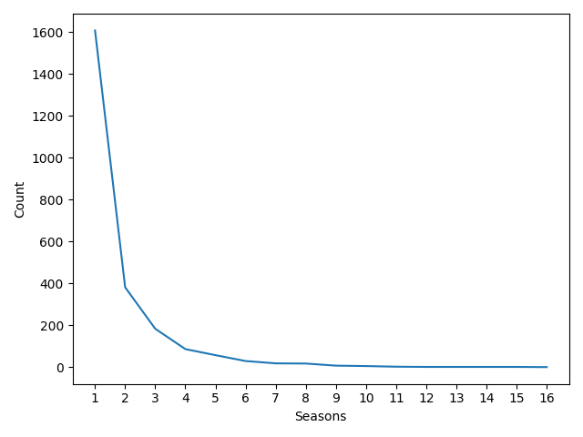

## async-final-project-blue-Harrison

## Dataset
[Netflix Data](https://www.kaggle.com/datasets/rohitgrewal/netflix-data )

## Why did I chose this dataset?

I don't actually use Netflix. Maybe one day when I do, I'll have a good idea of what I want to watch. Otherwise, I'd like to know more about popular media.

## Progress
- [X] Picked dataset
- [ ] Defined 10 questions
- [ ] Answered 10 questions using Pandas
- [ ] Added at least one data visualization (using Matplotlib and/or Seaborn) to each single question
- [ ] Prepared presentation slides to present at graduation

## Questions
- [X] Question 1: Are there more movies or TV shows?
  - Answer: There are more movies than TV shows, with 5,377 movies — more than double the 2,410 shows.
  - Visualization: 

- [X] Question 2: What genres are most common?
  - Answer: Drama is the most common genre followed by Comedy, Documentary/Reality, and Thriller/Mystery/Crime.
  - Visualization: 

- [X] Question 3: How long are movies on average?
  - Answer: The average length of a movie is roughly 99 minutes with the shortest being 3 minutes and the longest being 312 minutes.
  - Visualization: 

- [X] Question 4: Do many TV shows make it past the first season?
  - Answer: Most shows don't make it past the first season with only 532 out of 2410 shows getting more than one season.
  - Visualization: 

- [X] Question 5: Which countries are more prolific in media?
  - Answer: The United States is most common, followed by India and the UK. (Countries that make up a small portion have been grouped as 'Other')
  - Visualization: 

- [X] Question 6: Do movies get longer as the years go by?
  - Answer: Median movie length seems to be creeping higher.
  - Visualization: 

- [ ] Question 7: How about TV seasons?
  - Answer: There are more TV shows with more seasons than before.
  - Visualization: 

- [ ] Question 8: [Brief description of the task]
  - Answer: [Placeholder for answer]
  - Visualization: 

- [ ] Question 9: [Brief description of the task]
  - Answer: [Placeholder for answer]
  - Visualization: 

- [ ] Question 10: [Brief description of the task]
  - Answer: [Placeholder for answer]
  - Visualization: 
